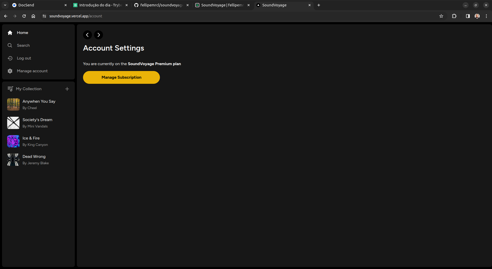
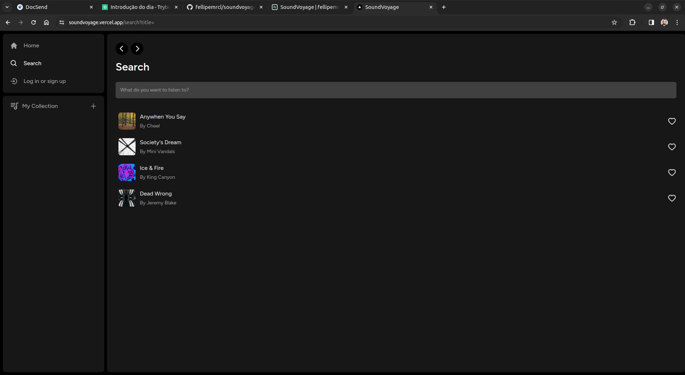

# SoundVoyage

Um web player de música. Faça o upload do seu som, compartilhe com a comunidade, e escute as músicas favoritas dos amantes de músicas, como você.


## Licença

[MIT](https://choosealicense.com/licenses/mit/)


## Screenshots







## Rodando o projeto localmente

- Faça o clone do projeto: 

```
git clone git@github.com:fellipemrcl/soundvoyage.git
```

- Navegue até a pasta recém criada:

```
cd soundvoyage/
```

- Instale as dependências do projeto:

```
npm install
```

- Rode o projeto:

```
npm run dev
```
## Funcionalidades

- Cadastro de usuários
- Cadastro com o GitHub ou e-mail e senha (via link mágico)
- Gerenciamento de assinaturas (via Stripe)
- Upload de músicas com metadados
- Player de música funcional


## Próximas implementações

- Barra de progresso da música no player
- Arrastar e soltar para redimensionar barra lateral esquerda
- Login com o Google e Facebook
## Aprendizados

Nesse projeto, pude aprender mais sobre design patterns e padrões de código, já que foi necessária uma melhor organização de pastas e componentes, visando a escalabilidade do código. 

Aprendi também mais funcionalidades avançadas do Next.js, como cache e rotas dinâmicas. Coloquei a mão na massa também, pela primeira vez, no Stripe, para fazer o gerenciamento de assinaturas dos usuários.

O maior desafio com certeza foi a integração da aplicação com o Stripe, já que o conceito de webhooks ainda era novo para mim. Depois de vários dias, consegui superar essa dificuldade através da magnífica documentação do Stripe, além de vídeos no YouTube e algumas horas de leitura no StackOverflow.

## Stack utilizada

**Front-end:** React, Next.js, Context API, Zustand, Tailwind CSS, shadcn UI

**Back-end:** Node, Prisma, Supabase, Stripe

